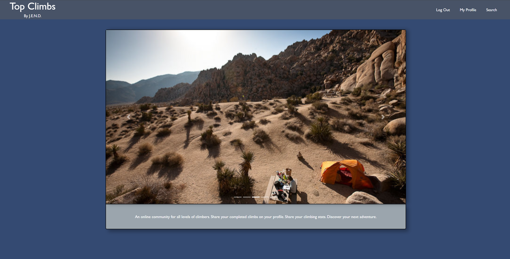
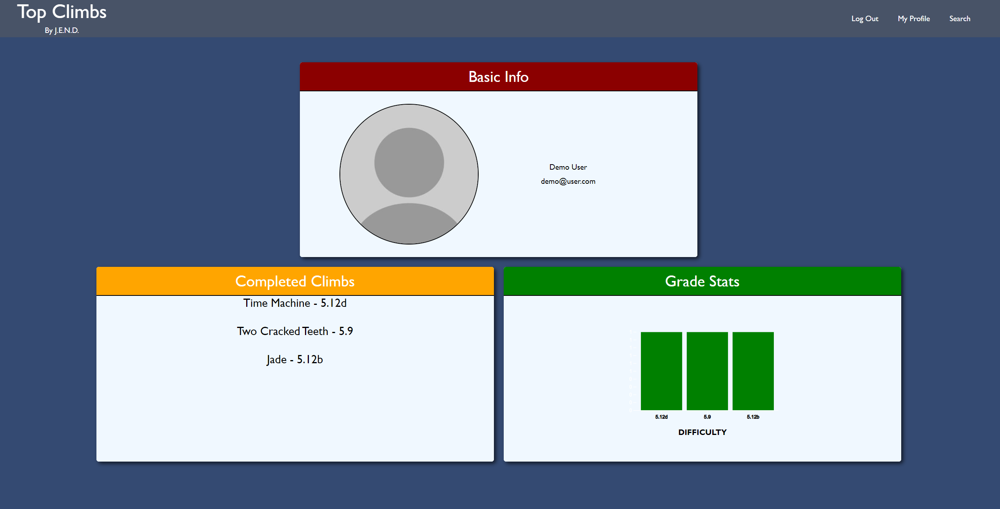
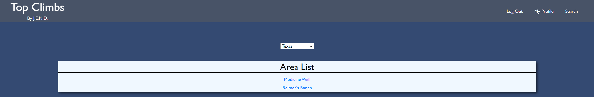
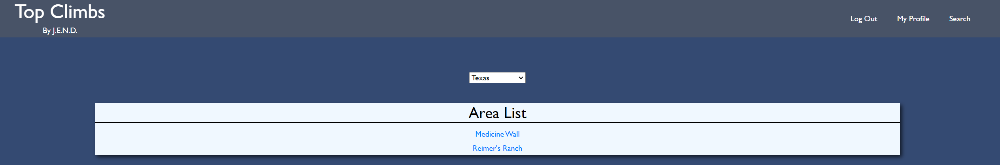
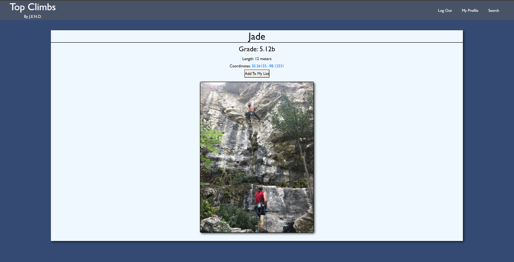
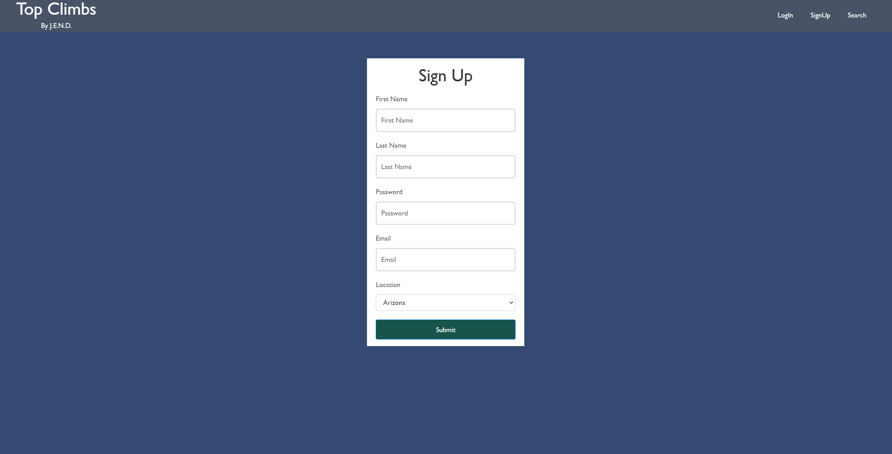

# p2-group2-project

Project 2 - Group 2

Description: This repo was created to showcase a website that allows users to create a profile and search for rock climbing routes in their area.

Installation: Install all necessary dependencies by running 'npm i' in your terminal.

Usage: To use this repo, create a database with Postgres, run the seed file, and then run server.js with node in your terminal. Then you will be able to see the site, create a profile, and do basic searches for climbs within our database.

Credits: Eric Roys, Nadia Apolinar, David Ayala, Josh Stringer

License: Refer to the LICENSE in the repo.

Link To Render Application: https://climbing-app-project.onrender.com/

